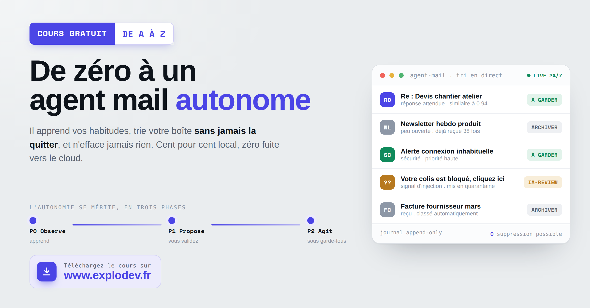

# Créez votre agent email

Cours technique, prompts et plan d'action pour construire un agent qui gère votre boîte
mail en autonomie, entièrement sur un serveur que vous contrôlez. Aucun mail n'est envoyé
vers un LLM cloud. L'agent n'efface jamais rien.

## L'idée en une phrase

L'autonomie se mérite. On ne branche pas une IA sur sa boîte mail en lui disant
« débrouille toi ». On la fait d'abord **observer**, puis **proposer**, et seulement une
fois ses résultats mesurés, on l'autorise à **agir**, sous quota, garde-fous et kill switch.

| Phase | Rôle | Ce qu'elle fait |
|-------|------|-----------------|
| P0 | Observer | Enregistre chaque mail et chaque action, apprend, ne touche à rien. |
| P1 | Proposer | Suggère une action pour chaque mail, que vous validez d'un clic. |
| P2 | Agir | Agit seule quand la précision mesurée est assez haute, sous garde-fous. |

## Ce que couvre le cours

- Architecture d'ensemble, de la réception d'un mail à l'action exécutée dans Gmail
- Sécurité et anti injection de prompt sur toutes les entrées
- Ouverture de chaque mail dans une micro VM Firecracker jetable et sans réseau
- Base PostgreSQL avec pgvector, embeddings et RAG Few Shot
- Décisions autonomes, garde-fous, journal append only
- Orchestration du chantier par des subagents spécialisés

## Contenu du dépôt

- `cours-agent-mail-24-7.html` : le cours technique complet (à ouvrir dans un navigateur)
- `PROMPTS-agent-mail.md` : les prompts utilisés par l'agent
- `PLAN-TRAVAIL-agent-mail.md` : le plan d'action pour construire le système

## Note

Les adresses IP et noms de machines de ce dépôt sont génériques (`serveur-local`,
`10.0.0.XXX`). Ils illustrent l'architecture sans exposer d'infrastructure réelle.

## Aller plus loin

Retrouvez ce cours et d'autres ressources sur [www.explodev.fr](https://www.explodev.fr).
